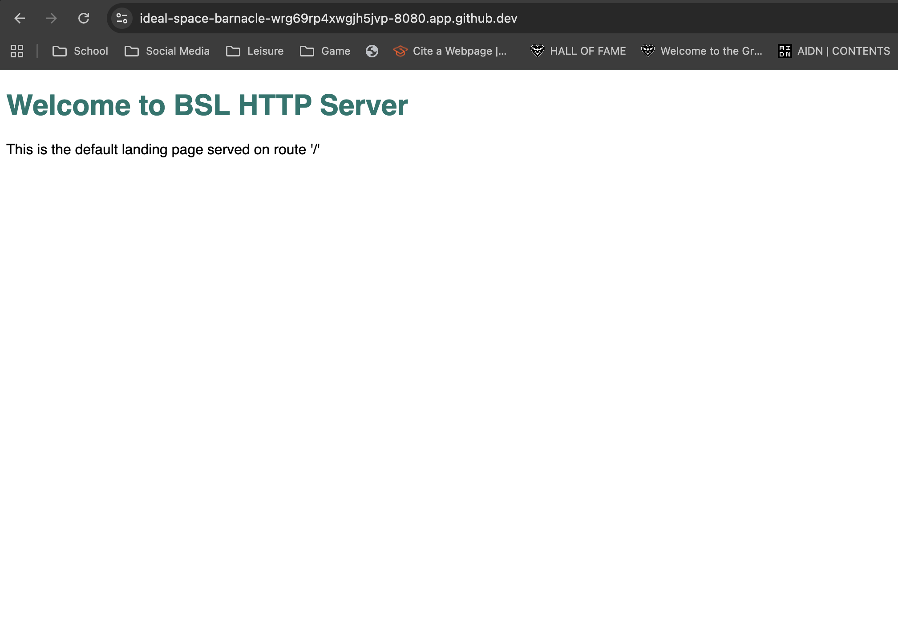
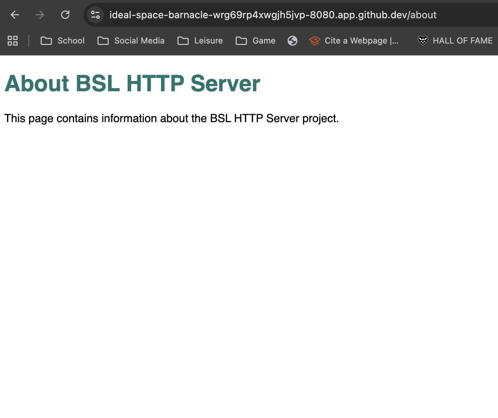
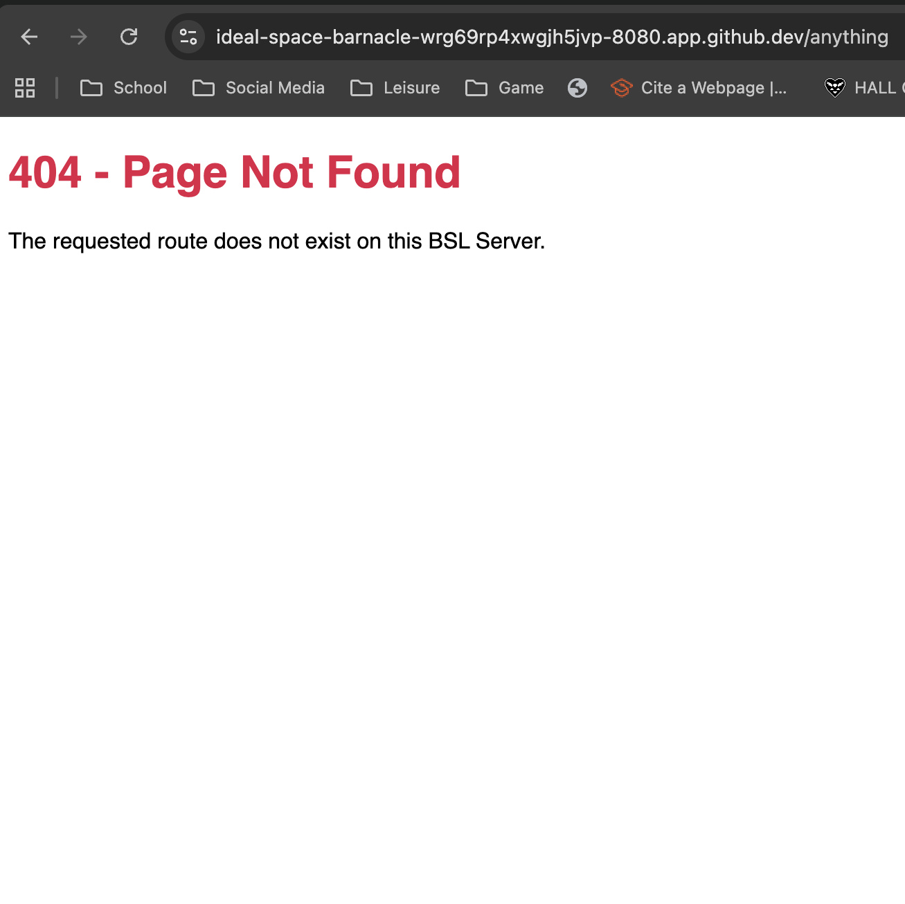
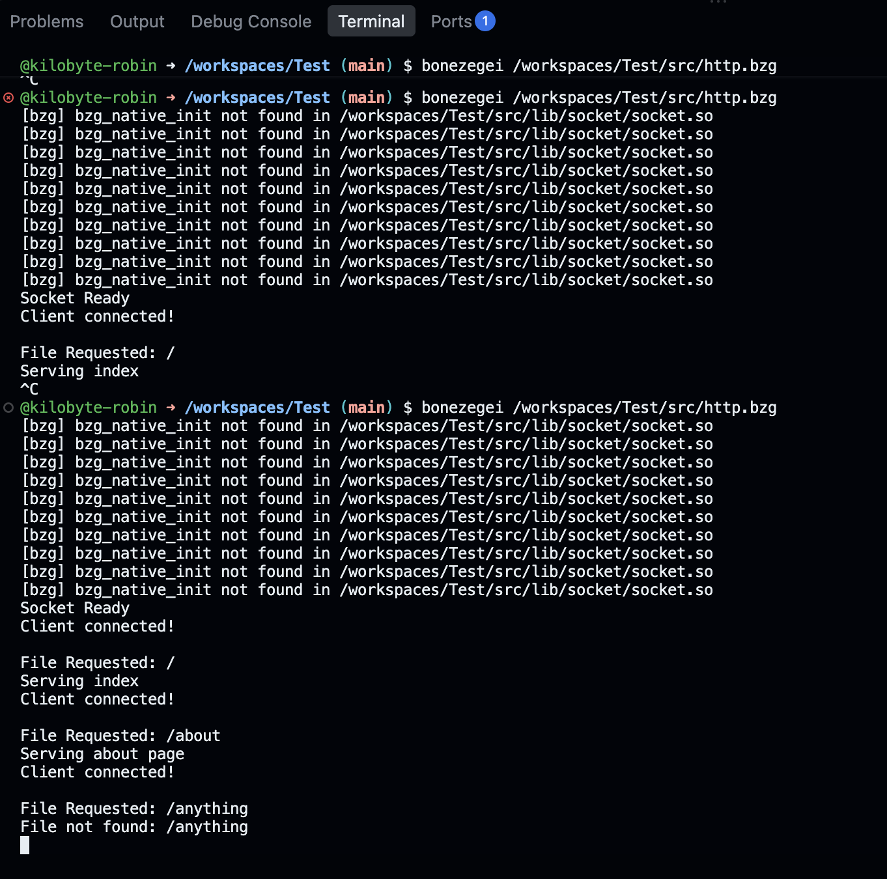

# BSL HTTP Server

**Project Description**
This project is for a lab activity, it is a low-level HTTP Web Server built from scratch using the Bonezegei Scripting Language (BSL) and the BSL Socket Library. It binds to port 8080 and handles custom HTTP request routing to serve specific HTML payloads for the root and about pages, as well as a custom 404 error page for unrecognized routes. 

**Installation & Setup Guide**
1. Install the "Bonezegei Scripting Language Formatter" extension in Visual Studio Code.
2. Follow the embedded extension instructions to install the Bonezegei Interpreter (using Linux instructions for GitHub Codespaces).
3. Open the terminal and run `bzg install socket` to install the required socket library.
4. Clone this repository and ensure the file structure includes `src/http.bzg` and the `lib/` folder.

**Usage Instructions**
1. Open the VS Code terminal and navigate to the project root.
2. Start the server by running the command: `bonezegei src/http.bzg`
3. Navigate to the "Ports" tab in GitHub Codespaces and open the port 8080 address in your browser.
4. To test routing, modify the end of the URL:
   * **Home:** `/`
   * **About:** `/about`
   * **404 Not Found:** `/anything` (or any other unmapped route)

**Screenshots**
Below are screenshots demonstrating the server's functionality across different routes and the active terminal environment.

**Home Route (/)**

**About Route (/about)**

**404 Not Found Page**

**Terminal Output**
